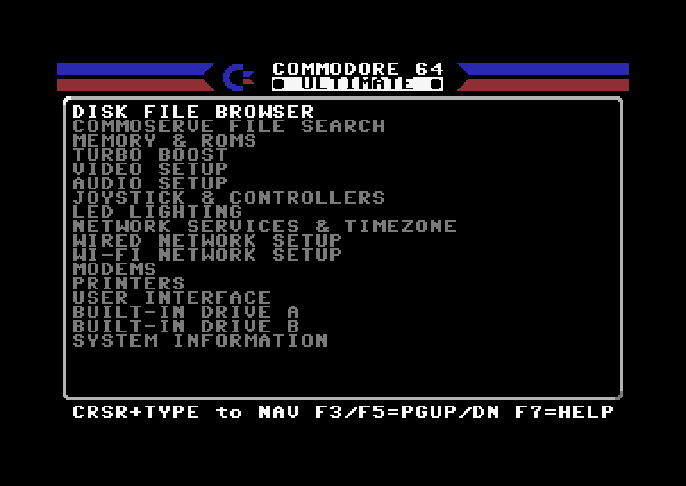
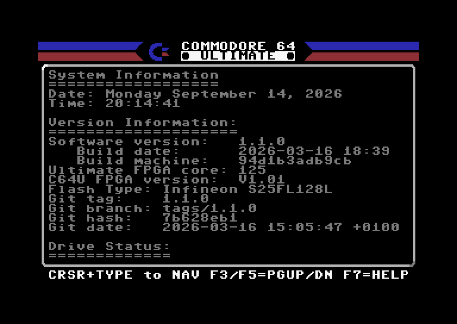
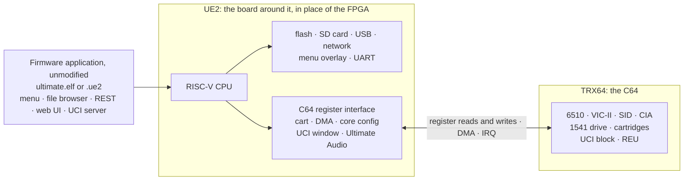

# UE2-C64U-Emulator

Run the firmware of the Ultimate 64 Elite II and the C64 Ultimate on your computer, and develop and test it without
flashing a device.

<p>
  
  
  
  
</p>

The Commodore C64 Ultimate firmware 1.1.0 runs as well:

<p>
  
  
</p>

The emulator runs the application part of the firmware unmodified: `ultimate.elf`, or the application inside a `.ue2`
update file. That is where the menu, file browser, REST API and web UI come from. The FPGA part of the firmware does
not run; the emulator models the hardware the application talks to instead: flash, SD card, USB, network and the menu
overlay. The C64 core is replaced by [TRX64](https://github.com/Jondalar/TRX64) behind the same register interface,
with SID sound, cartridges and a 1541 drive. An MCP server lets Claude Code sessions start and drive emulator
instances for automated tests.



## Install

```sh
brew install jondalar/ue2emu/ue2emu
```

To build from source, see [docs/status/install.md](docs/status/install.md). macOS is the main platform. Linux builds
and passes CI but has not been used in practice. Windows builds in CI; the releases have a Windows zip.

## Getting started

Firmware and ROMs are not included. You need:

- a firmware image: your own `ultimate.elf` build or an `update.ue2` file
- the `roms` folder of a [1541ultimate](https://github.com/GideonZ/1541ultimate) checkout, for the menu font and the
  C64 ROMs

```sh
# Once: run the updater inside the .ue2 into a flash image and add the C64 ROMs.
ue2emu install --update update.ue2 --flash flash.bin --roms 1541ultimate/roms --yes --c64-roms

# Start. F12 opens the menu, the cursor keys navigate.
ue2emu run --firmware update.ue2 --flash flash.bin --roms 1541ultimate/roms --net user
```

With `--net user` the web UI is at http://127.0.0.1:8080. `ue2emu run --help` lists all options. They can also go
into a TOML file, started with `ue2emu run --config my.toml` ([example](docs/examples/ue2emu.example.toml)).

## Documentation

- [Usage](docs/status/install.md): build, options, config files, `install`, ROMs, MCP server
- [Status](docs/status/README.md): what works, by area
- [Architecture](docs/ARCHITECTURE.md)

## License

GPL-3.0-or-later. The cartridge logic is ported from GideonZ/1541ultimate (GPL). SID sound uses reSID by Dag Lem
(GPL-2.0-or-later) from the VICE project, compiled in through TRX64.
