# Architecture — UE2-C64U-Emulator

This document follows the arc42 template. It gives the overview and links to the documents that hold the detail:
the specs in [specs/](specs/) (design, owned files, acceptance), the status docs in [status/](status/) (results, numbers,
known gaps per area) and the hardware analysis in [hw/](hw/) (register behaviour with firmware citations).

1. [Introduction and Goals](#1-introduction-and-goals)
2. [Architecture Constraints](#2-architecture-constraints)
3. [System Scope and Context](#3-system-scope-and-context)
4. [Solution Strategy](#4-solution-strategy)
5. [Building Block View](#5-building-block-view)
6. [Runtime View](#6-runtime-view)
7. [Deployment View](#7-deployment-view)
8. [Cross-cutting Concepts](#8-cross-cutting-concepts)
9. [Architecture Decisions](#9-architecture-decisions)
10. [Quality Requirements](#10-quality-requirements)
11. [Risks and Technical Debt](#11-risks-and-technical-debt)
12. [Glossary](#12-glossary)

## 1. Introduction and Goals

UE2 runs the **unmodified** U64-II / C64 Ultimate firmware application (`ultimate.elf`, upstream GideonZ/1541ultimate,
target `u64ii/riscv/ultimate`; or `ultimate.app`, or the application inside a `.ue2` update file) on macOS, so the menu
UI, file browser, config and network services can be developed and tested without flashing. The FPGA part of the
firmware does not run. UE2 models the board hardware the application talks to instead. The C64 core inside the FPGA
is replaced by TRX64 (`trx64-core`, [S14](specs/S14-c64-trx64.md)) behind the same registers, with SID, cartridges,
drive A, UCI, REU and Ultimate Audio. `--c64 none` keeps the T0 stub that only satisfies the handshakes.

### Requirements overview

| Area | What UE2 provides | Details |
|---|---|---|
| Boot | ELF, `.app` and `.ue2` boot to the FreeRTOS idle loop, all InitFunctions run | [boot.md](status/boot.md) |
| Menu and input | Overlay menu in a window or headless; C64 key matrix, menu button, USB HID keyboard | [boot.md](status/boot.md), [usb.md](status/usb.md) |
| Storage | Persistent SPI flash image, SD image, USB images, a host directory as a USB stick | [storage.md](status/storage.md), [usb.md](status/usb.md), [usb-dir.md](status/usb-dir.md) |
| Network | REST, web UI, FTP, Telnet through libslirp; bridged modes through vmnet or socket_vmnet | [network.md](status/network.md), [e2e.md](status/e2e.md) |
| C64 | TRX64: DMA, reset/stop, video under the overlay, SID audio, 27 cartridge types, a physical cartridge slot, drive A as a 1541, UCI, REU, Ultimate Audio | [c64.md](status/c64.md) and the docs it links |
| Install | Run the updater of a `.ue2` into a flash image | [install.md](status/install.md) §5 |
| Automation | Control scripts, TCP control protocol, MCP server | [tooling.md](status/tooling.md), [mcp.md](status/mcp.md) |
| Debugging | Symbolized logs, fault hooks, CPU trace ring, GDB stub | [Debugging](#debugging) |

### Milestones

| M | Name | Acceptance |
|---|---|---|
| M1 | Console | Headless run prints the firmware boot log (capabilities line) with no fault hook. |
| M2 | Main loop | All InitFunctions run, the scheduler idles, no hang or assert for 60 s emulated. Every boot-relevant unmapped access is modelled or documented. |
| M3 | Menu | A script presses the menu button; `screen` shows the overlay menu; cursor keys change the selection. The window shows the same. |
| M4 | Storage | Config persists across runs (flash image). An SD image shows up in the file browser. |
| M5 | Network | Web UI, REST, FTP and Telnet reachable from the Mac through a libslirp port-forward. The upstream E2E smoke profile runs against the emulator. |
| M6 | USB | USB mass storage (image) and HID keyboard. |
| M7 | C64 | TRX64 attached: DMA, reset/stop, cart, drive A, video behind the overlay. |

Status:
- M1-M3 reached ([boot.md](status/boot.md)), M4 reached ([storage.md](status/storage.md)).
- M5: REST, Telnet and FTP through libslirp work, and the upstream E2E smoke profile passes 12 of 12 with the REST
  shim ([network.md](status/network.md), [e2e.md](status/e2e.md)).
- M6 reached ([usb.md](status/usb.md)).
- M7 reached: DMA, reset/stop and video behind the overlay (phase A); SID with audio, the FPGA cartridge types and
  drive A as a 1541 (wave 4); `--c64-roms`; a cartridge in the physical expansion port (`--cart-slot`,
  [cart-slot.md](status/cart-slot.md)). Since then: UCI ([S15](specs/S15-uci.md)), the REU ([reu.md](status/reu.md)),
  Ultimate Audio ([S16](specs/S16-ultimate-audio.md)); several SIDs and the mixer land with
  [S17](specs/S17-ultisid.md). Since then: NTSC ([S25](specs/S25-ntsc.md)), drives A and B on TRX64's drive part ([S27](specs/S27-drives-870.md)), the IEC
  processor on the bus ([S30](specs/S30-soft-iec.md)).

### Quality goals

| Priority | Goal | What it means here |
|---|---|---|
| 1 | Firmware fidelity | The firmware is never patched. The emulator adapts to it, documented defects included. The boot path hits no unmapped IO address. |
| 2 | Testable without a person | UI, network and C64 checks run headless and check themselves: control scripts, PNGs, the MCP server, CI. |
| 3 | Speed | Realtime needs 25 MIPS. `--speed max` runs several times faster than hardware, so tests are short. |
| 4 | Safety of user data | `--usb-dir` never deletes or overwrites a host file without a copy; flash and CRT write-back complete on a clean exit. |
| 5 | Isolation of the C64 core | ue2-core builds and tests without TRX64 and without a C++ toolchain. Moving TRX64 is a pinned, tested step. |

### Stakeholders

| Stakeholder | Expectation |
|---|---|
| Firmware developers (1541ultimate) | Boot their own build, use the menu, REST, FTP, Telnet and the C64 without flashing a device ([README](../README.md)) |
| Claude Code sessions | Start and drive emulator instances through `ue2-mcp`, get PASS/FAIL results ([mcp.md](status/mcp.md)) |
| Spec agents | One spec per step with owned files and acceptance ([specs/](specs/)) |
| TRX64 maintainers | Requirements and API gaps reported from UE2 ([trx64-uci-requirements.md](specs/trx64-uci-requirements.md), [carts.md](status/carts.md), [drive.md](status/drive.md), [reu.md](status/reu.md)) |
| Upstream E2E suite | Runs against the emulator through port forwards ([e2e.md](status/e2e.md)) |
| C64 programs that use Ultimate features | Serve as test cases: UBoot64, demos, GEOS tools ([xander-tests.md](status/xander-tests.md)) |

## 2. Architecture Constraints

### Technical and organizational constraints

| Constraint | Consequence | Source |
|---|---|---|
| The firmware runs unmodified | The emulator adapts to the firmware, including its documented defects ([00-memory-map](hw/00-memory-map.md) §"Firmware defects") | [Rules](#rules) |
| No firmware and no ROMs in the repository | Users bring `ultimate.elf`/`.ue2` and the `roms/` of a 1541ultimate clone. `.gitignore` keeps firmware, ROM and media images out. Tests that need them skip | [install.md](status/install.md) §2 |
| The U64-II FPGA top level is closed | Behaviour comes from the firmware sources and the open VHDL of other boards and blocks. Open points are listed as open questions | [boot.md](status/boot.md) §Known gaps, [S15](specs/S15-uci.md) §6, [S16](specs/S16-ultimate-audio.md) §6 |
| License GPL-3.0-or-later | The cartridge logic is ported from GideonZ/1541ultimate (GPL v3). reSID by Dag Lem (GPL-2.0-or-later) from VICE is compiled in through TRX64 | [README](../README.md), [install.md](status/install.md) §7 |
| TRX64 is a git dependency pinned by rev | `crates/c64-bridge/Cargo.toml` names the rev (TRX64 v0.7.3 `4ab20e5`, with Spec 855's several SIDs, 856's turbo fast path and 857's CIA alarm check). Cargo fetches it on the first build. The bridge drives TRX64 internals, so the tests and the C64 smokes run before `rev` moves. A local checkout is patched in through an untracked `.cargo/config.toml` | [install.md](status/install.md) "TRX64 dependency" |
| C++ compiler | `trx64-core` compiles the vendored reSID (default feature `trx64`). `--no-default-features` builds without TRX64, `--c64 none` only | [install.md](status/install.md) §1 |
| libslirp system library, 4.7 API | `crates/ue2-net/build.rs` searches `SLIRP_LIB_DIR`, else `/opt/homebrew/lib`, else the linker's default paths | [install.md](status/install.md) §1 |
| Platforms | macOS is the main platform (Apple silicon). Linux builds and passes CI but is not used interactively. Windows (MSVC) builds and tests in CI and ships as a release zip; its networking is `--net user` only ([S22](specs/S22-windows.md)). `--net vmnet-bridged` is macOS only, `socket-vmnet` Unix only | [install.md](status/install.md) "Platforms" |
| Rust stable | Built and tested with rustc 1.98.1. The dev profile uses opt-level 1, because the interpreter is unusably slow at 0 | [install.md](status/install.md) §1, [Cargo.toml](../Cargo.toml) |

### Hardware facts that shape the design

- **CPU:** rvlite RV32IM (the firmware uses no DIV/REM), M-mode only, direct-mode traps. One external
  interrupt line from the ITU (`mcause 0x8000000B`). No CLINT/MTIME. The idle task spins without WFI, so
  **emulated time advances per executed instruction**, and a loop that cannot change anything is fast-forwarded to
  the next device event ([S19](specs/S19-idle-skip.md)).
- **Memory:** 64 MB DDR at 0 (bit 28 = 0, mirrored modulo 64 MB), except `0x8000xxxx`, which is the rvlite boot
  BRAM (bus_converter.vhd:96,118). Instruction fetches ignore bit 28 (rvlite_wrapper.vhd:101-106). 8-bit IO bus
  `0x10000000-0x10FFFFFF`. 16/32-bit IO accesses are little-endian byte sequences, each byte with its own side effects.
  No bus faults. Unmapped reads return 0, unmapped writes are ignored.
- **Tick:** FreeRTOS 200 Hz tick = ITU timer edge IRQ bit 0 every 499 968 clocks (100 MHz clock).
- **UI:** overlay chargen — 4 K screen RAM `0x10141000`, 4 K colour RAM `0x10142000`, palette `0x10145000`.
  Shown only when HPD = 1 and `CFG_USERIF_ITYPE = 1`.
- **Input:** 8×8 keyboard matrix (COL `0x1010040A` write, ROW `0x1010040B` read). Menu button = ITU
  `0x1000000A` bit 6.
- **Capabilities:** `0x34000226`, the T0 word `0x34000222` plus CAPAB_DRIVE_1541_2 (bit 2, drive B, which a C64
  Ultimate lists; S27). The banners below are quoted from before that bit. `--net` adds CAPAB_ETH_RMII (bit 24), a USB device CAPAB_USB_HOST2 (bit 23).
  The TRX64 C64 adds CAPAB_EEPROM (bit 22, GMOD2 carts), which makes the default boot banner `34400222`;
  CAPAB_COMMAND_INTF (bit 18, [S15](specs/S15-uci.md), banner `34440222`); and CAPAB_SAMPLER (bit 21,
  [S16](specs/S16-ultimate-audio.md)). With a USB device as well the word is `34E40222`. An explicit `--caps` is used as
  given, without these bits ([sampler.md](status/sampler.md) §Known gaps).

### Ground truth

| Source | Role |
|---|---|
| [hw/00-memory-map.md](hw/00-memory-map.md) | Consolidated address map, boot hazards in execution order, IRQ model, T0/T1 tiers. **Authoritative for register behaviour.** |
| `docs/hw/01..12-*.md` | Per-block detail with firmware `file:line` citations. |
| `firmware/1541ultimate` | Upstream clone (untracked), built by `scripts/build-firmware.sh`. Never patched. |
| `docs/specs/S*.md` | Implementation step specs (scope, owned files, acceptance). |
| `docs/status/*.md` | Results, measurements and known gaps per area. |
| `docs/research/*.md` | Studies that are not specs ([c64u-fpga-vs-gideon.md](research/c64u-fpga-vs-gideon.md), [fpga-emulation.md](research/fpga-emulation.md)). |

If a doc turns out wrong, fix the doc (with a citation) in the same change as the code.

### Rules

- The firmware is never patched. The emulator adapts to the firmware, including its documented defects
  (00-memory-map §"Firmware defects").
- A device that is not modelled reads 0 and ignores writes; boot hazards come first.
- Every device model has unit tests against its `docs/hw` behaviour. Tests that need the real ELF skip
  when `firmware/` is absent.
- Wave agents write only the files their spec owns. Needed interface changes are reported, not made.
- Before a symbol is edited, a GitNexus impact analysis runs; before a commit, a change detection
  ([CLAUDE.md](../CLAUDE.md), [AGENTS.md](../AGENTS.md)). See [Change discipline](#change-discipline).

## 3. System Scope and Context

### Business context

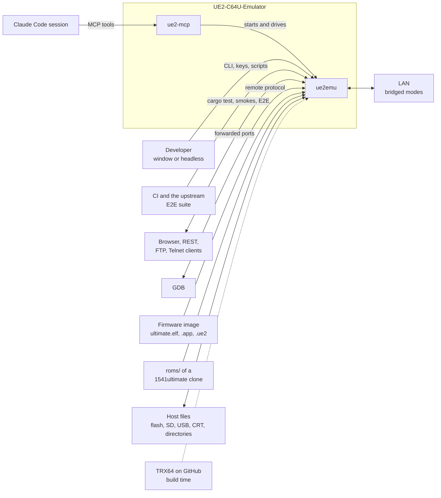

| Partner | Gives UE2 | Gets from UE2 |
|---|---|---|
| Developer | Command line or TOML config, keys in the window, control scripts | Window with overlay and C64 picture, audio, console on stdout, diagnostics on stderr |
| Claude Code session | MCP tool calls | Screen text, PNGs, console, REST answers, PASS/FAIL ([mcp.md](status/mcp.md)) |
| CI, E2E suite | Test runs | Exit codes, reports ([e2e.md](status/e2e.md)) |
| Browser and network clients | HTTP, FTP, Telnet, DMA socket | The firmware's own services |
| GDB | Breakpoints, steps, memory reads | Registers, memory, FreeRTOS task list |
| Firmware image and roms | The application; the overlay font `chars.bin`, C64 ROM seeds and `--c64-roms` sources | — |
| Host files | Flash, SD and USB images, host directories, CRT files | Written flash, images, synced directories, CRTs, WAV and PNG files |
| TRX64 | `trx64-core` at the pinned rev | Requirements and API gap reports |
| LAN | DHCP and traffic in the bridged modes | The device with its own MAC |

### Technical context

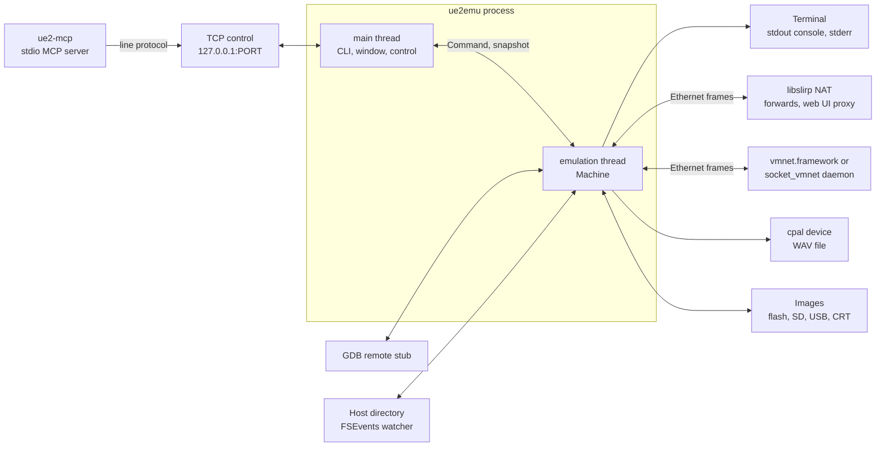

| Interface | Technology | Code | Doc |
|---|---|---|---|
| Command line, config file | clap; `run --config FILE.toml` | `crates/ue2emu/src/main.rs`, `config.rs` | [install.md](status/install.md) §3-4 |
| Window and keys | winit 0.30 + softbuffer 0.4 | `window.rs`, `keymap.rs` | [Host side](#host-side) |
| Audio | cpal 0.15 (CoreAudio, ALSA); WAV writer | `audio.rs` | [sid-audio.md](status/sid-audio.md) |
| Control | One command per line, from `--script` or TCP `--control` | `control.rs` | [S08](specs/S08-frontend-control.md), [tooling.md](status/tooling.md), [mcp.md](status/mcp.md) "Direct API" |
| MCP | stdio JSON-RPC, `rmcp` 3.3; child processes over the TCP control protocol | `crates/ue2-mcp` | [mcp.md](status/mcp.md) |
| Network | libslirp (hand-written FFI), vmnet.framework (block2 FFI), socket_vmnet (unix socket, length-prefixed frames); forwards and web UI proxy on 127.0.0.1 | `crates/ue2-net`, `crates/ue2emu/src/net.rs` | [network.md](status/network.md) |
| Debugger | GDB remote protocol, `gdbstub` 0.7 | `crates/ue2emu/src/gdb.rs` | [Debugging](#debugging) |
| Files | Flash image (16 MiB), SD and USB images, `--usb-dir` volumes with a notify/FSEvents watcher, CRT write-back, WAV, PNG | `devices/flash.rs`, `sdcard.rs`, `usb/`, `crates/ue2-vfat`, `cartslot.rs` | [storage.md](status/storage.md), [usb-dir.md](status/usb-dir.md), [cart-slot.md](status/cart-slot.md) |
| Console | Firmware UART on stdout, emulator diagnostics and stats on stderr | `runner.rs` | [boot.md](status/boot.md) |

## 4. Solution Strategy

| Goal | Approach |
|---|---|
| Run the firmware unmodified | Interpret RV32IM with rvlite semantics ([S01](specs/S01-cpu-rv32.md)). Load the application straight into DDR. Model every IO window the firmware touches, in boot-hazard order ([hw/00](hw/00-memory-map.md) §2) |
| Correct before complete | Per block a T0 model (boots without hanging), then a T1 model (functional). Anything not modelled reads 0 and ignores writes |
| A real C64 behind the FPGA registers | A `C64Backend` trait in ue2-core, TRX64 behind it in `c64-bridge`, linked through a cargo feature. C64 hardware lives in TRX64 (6510, VIC, CIA, drive, UCI block, REU). U64 FPGA hardware lives in UE2 (cart logic, sampler, SID decode, mixer, bus sharing) ([S14](specs/S14-c64-trx64.md)-[S17](specs/S17-ultisid.md)) |
| Timing independent of host speed | One 100 MHz emulated clock, advanced per instruction. Devices, the C64, inputs and test waits all run on it; pacing maps it to the wall clock ([Emulated time](#emulated-time-and-clocking)) |
| Tests without a person | A control language with `expect`, PNG output, self-checking smoke scripts, an MCP server, CI, and the upstream E2E suite through port forwards |
| Host integration without root | libslirp NAT with forwards and a web UI proxy; the bridged modes are optional |
| The firmware owns its data formats | The emulator moves bytes: GCR tracks and CRT banks in DDR, the updater writes the flash, `--c64-roms` writes into the FAT volume the firmware formats, `--settings` writes config records by the definitions it reads from the firmware image |
| Safe write-back | Debounced flash write-back, CRT backups, the `--usb-dir` sync rules |
| Work in small, checkable steps | Specs with owned files and acceptance, built in waves; each result recorded in a status doc |

### Specs

| Spec | Scope | Wave |
|---|---|---|
| [S01](specs/S01-cpu-rv32.md) | RV32 CPU (rvlite semantics) + riscv-tests | 1 |
| [S02](specs/S02-core.md) | Core: SystemBus, loader, symbols, Machine loop, runner/pacing | 1 |
| [S03](specs/S03-itu-uart.md) | ITU + UART + capabilities (+ IrqState semantics) | 1 |
| [S04](specs/S04-board-t0.md) | Board T0 models (I2C, U2PIO, C64 cart/DMA/core, USB nano, drives, IEC/UCI/ACIA/tape, misc) | 1 |
| [S05](specs/S05-wifi-u64ctrl.md) | WiFi DMA UART + stub u64ctrl | 1 |
| [S06](specs/S06-spi-flash.md) | SPI flash NOR (persistent) + overlay-UI config seeding | 1 |
| [S07](specs/S07-overlay-u64io-render.md) | Overlay device, U64 IO page (keyboard matrix), renderer | 1 |
| [S08](specs/S08-frontend-control.md) | Frontend: window, keymap, control/script | 1 |
| [S09](specs/S09-sd-card.md) | SD card over SPI (image-backed) | 1 |
| [S10](specs/S10-integration.md) | Integration: boot to M1–M3 | 2 |
| [S11](specs/S11-S14-later.md) | Debug: GDB stub, trace ring | 2 |
| [S12](specs/S11-S14-later.md) | Network: RMII MAC, MDIO PHY, libslirp bridge | 3 |
| [S13](specs/S11-S14-later.md) | USB HLE (mass storage, HID) | 3 |
| [S14](specs/S14-c64-trx64.md) | C64 via TRX64 | 4 |
| [S15](specs/S15-uci.md) | Ultimate Command Interface: TRX64's block, UE2's firmware window and ITU bits | — |
| [S16](specs/S16-ultimate-audio.md) | Ultimate Audio: the sampler's eight DMA voices | — |
| [S17](specs/S17-ultisid.md) | UltiSID: several SIDs and the audio mixer (host side of TRX64 Spec 855) | — |
| [S19](specs/S19-idle-skip.md) | Idle skip: loops that cannot change anything fast-forward to the next device event | — |
| [S20](specs/S20-sid-thread.md) | The reSID engines on their own thread | — |
| [S21](specs/S21-settings.md) | Firmware settings from a `.cfg` into the flash before boot | — |
| [S22](specs/S22-windows.md) | Windows port: MSVC build, `--net user` through vcpkg's libslirp, release zip | — |

## 5. Building Block View

### Level 1: workspace

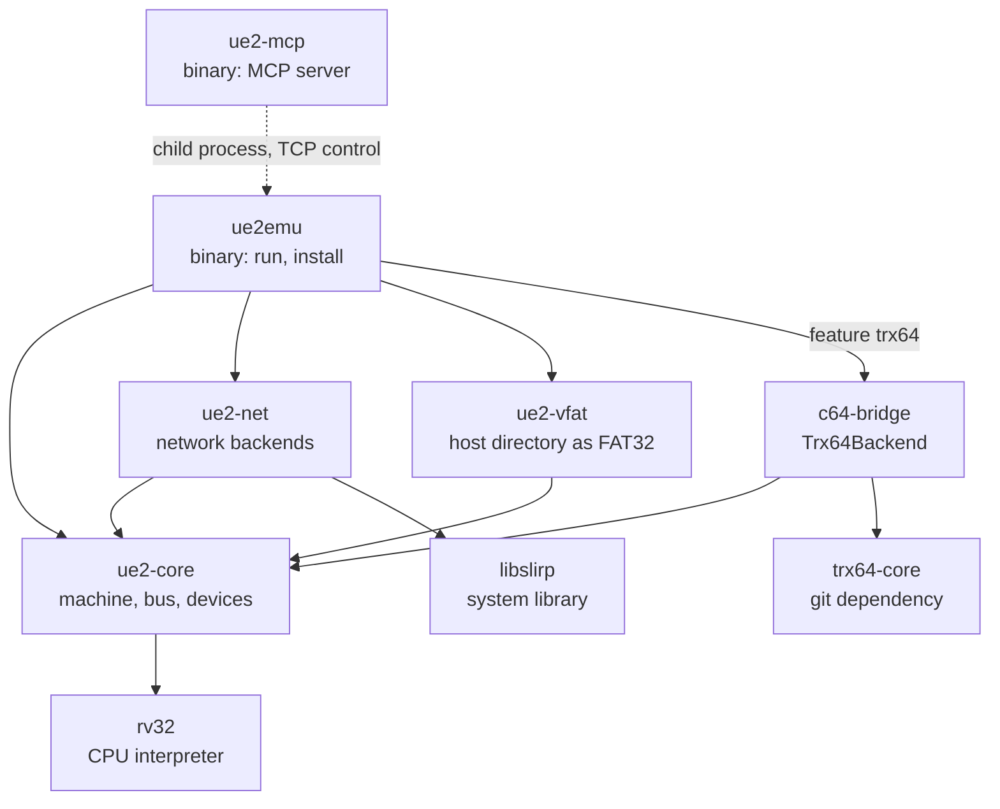

| Crate | Content |
|---|---|
| `crates/rv32` | CPU interpreter, `Bus` trait. No dependencies. Verified with the official riscv-tests. |
| `crates/ue2-core` | `SystemBus` (RAM + IO decode), `IoMap`/`IoDevice`, `IrqState` (ITU interrupt core), loader (ELF, `.app`, `.ue2`, updater records), symbolizer, settings (`.cfg` against the image's config definitions, S21), the firmware's cartridge ROM layout (`fwlayout`, [carts.md](status/carts.md)), `Machine` run loop, device models (`devices/*`, USB in `devices/usb/`), the C64 backend trait (`c64host`), overlay and C64 renderer (`render`), host types (`host`). No emulator dependency. |
| `crates/ue2-net` | Host network backends behind `host::NetBackend`: libslirp user-mode networking (hand-written FFI, links the system libslirp: `SLIRP_LIB_DIR`, else /opt/homebrew/lib when it exists, else the linker's default paths; build.rs), vmnet.framework bridged mode (`vmnet`, block2 FFI), a client of lima's socket_vmnet daemon (`socket_vmnet`), the web UI proxy (`web_proxy`). |
| `crates/ue2-vfat` | `--usb-dir`: FAT32 volume built from a host directory (fatfs crate), snapshot parser with a structure check, guest-to-host sync with its safety rules, host watcher (notify/FSEvents), worker thread ([usb-dir.md](status/usb-dir.md)). No emulator dependency beyond `usb::block::BlockBackend`. |
| `crates/c64-bridge` | `Trx64Backend`: TRX64 (`trx64-core`, git dependency on https://github.com/Jondalar/TRX64 pinned by rev `4ab20e5`) as a `c64host::C64Backend`: `sid` (SID decode, ARMSID identity, reSID sample stream; several engines with S17), `sampler` (Ultimate Audio, S16), `cart` and `cart_eeprom` (all_carts_v5.vhd, freezer.vhd and the GMOD2 EEPROM on guest DDR), `slot` (a cartridge in the physical expansion port: TRX64's mappers, flash boards on TRX64's flash and EEPROM chips, or `cart::CartLogic` fed from the CRT; bus sharing, bridge and CART_DETECT), `drive` (drive A on TRX64's drive 8 as a `c64host::C64Drive`), `reu` (TRX64's REU store over guest DDR), `keys`, `video`, `clock`. The rev is pinned in `crates/c64-bridge/Cargo.toml`; re-run the tests and the C64 smokes before moving it. |
| `crates/ue2emu` | Binary, `ue2emu run`, `ue2emu install` and `ue2emu settings`: CLI, `--config` TOML (`config`), emulation thread + pacing (`runner`), window (`window`, `keymap`), scripted/TCP control (`control`), network wiring (`net`), USB options (`usb`), `--usb-dir` controller (`usbdir`), SID audio out (`audio`: cpal and WAV), updater install (`install`), C64 ROMs into the flash image (`c64roms`, `--c64-roms`), physical cartridge write-back and `cart-info`/`cart-save` (`cartslot`, `--cart-slot`), GDB stub (`gdb`). Cargo feature `trx64` (default) links c64-bridge. |
| `crates/ue2-mcp` | Binary `ue2-mcp`: stdio MCP server that starts `ue2emu` instances and drives them through the TCP control protocol ([mcp.md](status/mcp.md)). No crate dependency on the emulator. |

### Level 2: ue2-core

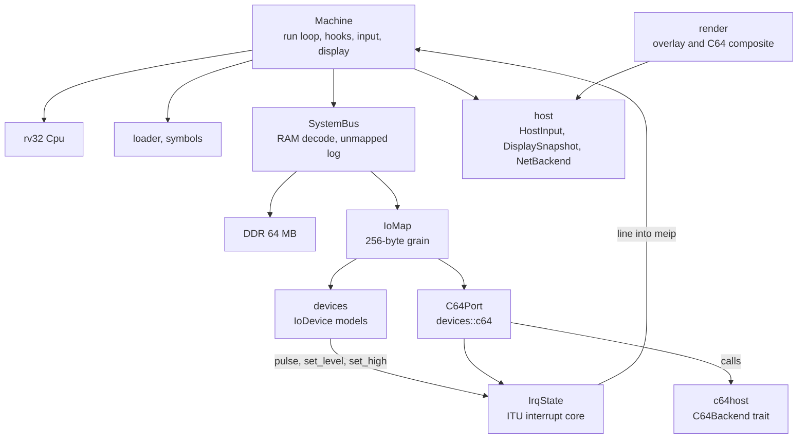

The bus, `IoMap`, `IoDevice` and `IrqState` are described in [Device model](#device-model-bus-iomap-and-devices).
The devices, by module:

| Module | Windows | Model | Spec, status |
|---|---|---|---|
| `itu.rs` | `0x10000000-0x100000FF` | ITU register view on `IrqState`, ITU_TIMER, IRQ timer, ms timer, capability word, menu button, UART to the console | [S03](specs/S03-itu-uart.md), [fixes.md](status/fixes.md) §4 |
| `board.rs` | U2PIO `0x10100000` (with the MDIO PHY), DDR2 PHY, CLOCKMEAS, audio mixer `0x10100500`, LED strip, Blingboard, MMCM `0x10200000` | T0 latches and constants, BOARDREV 0xB8. The mixer window moves to `C64Port` with S17 | [S04](specs/S04-board-t0.md), [S17](specs/S17-ultisid.md) §2.5 |
| `i2c.rs` | `0x10100700` | I2C master; an EDID EEPROM on channel 0 (1080p60 HDMI); other addresses ACK and read 0xFF | [fixes.md](status/fixes.md) §5 |
| `u64io.rs` | `0x10100400` | Keyboard matrix scan, joystick lines, HDMI HPD, CART_DETECT | [S07](specs/S07-overlay-u64io-render.md) |
| `overlay.rs` | `0x10140000-0x1014FFFF` | Chargen registers, screen and colour RAM, palette, `snapshot` | [S07](specs/S07-overlay-u64io-render.md) |
| `flash.rs` | `0x10060200` | S25FL128L SPI NOR, 16 MiB, persistent image, overlay-UI seed, `--settings` records (S21), replaceable unique ID | [S06](specs/S06-spi-flash.md), [storage.md](status/storage.md) |
| `sdcard.rs` | `0x10060000` | SDHC in SPI mode on an image | [S09](specs/S09-sd-card.md), [storage.md](status/storage.md) |
| `misc.rs` | RTC `0x10060100`, TRACE, RTC timer `0x10060400` (host UTC), GCR codec `0x10060500`, ICAP, audio select `0x10060700` | T0 | [S04](specs/S04-board-t0.md) |
| `wifi.rs` | `0x10060900` | DMA UART with a u64ctrl stub, the ESP32 ROM loader for updaters, power requests (`U64Ctrl::power_event`) | [S05](specs/S05-wifi-u64ctrl.md), [install.md](status/install.md) §5 |
| `rmii.rs` | `0x10060800` | RMII MAC: RX filter, TX, free queue, level IRQ bit 5, DMA buffers | [S12](specs/S11-S14-later.md), [network.md](status/network.md) |
| `usb/` | `0x10080000-0x10080FFF` | Nano USB CPU protocol HLE, USB2513 hub, mass storage, HID keyboard, hot-plug | [S13](specs/S11-S14-later.md), [usb.md](status/usb.md) |
| `iec.rs` | ACIA `0x1004A000`, tape `0x100A0000`/`0x100C0000` | T0 tables | [S04](specs/S04-board-t0.md) |
| `drives.rs` | Drives A `0x10020000` and B `0x10024000` (inside `C64Port`) | `DriveRegs`: each drives a `C64Drive` ([S27](specs/S27-drives-870.md)) | [S14](specs/S14-c64-trx64.md) §W4-DRIVE, [drive.md](status/drive.md) |
| `c64.rs` | `C64Port` windows (below); T0 tables for legacy SID `0x10042000`, CART_TIMING, PLD, U64 debug, glyph, UltiSID filter RAM `0x10184000`, UDP headers | The C64 behind the FPGA registers, or the T0 stub | [S14](specs/S14-c64-trx64.md)-[S17](specs/S17-ultisid.md) |

#### C64 port

**C64 (`devices::c64::C64Port`):** cart/machine registers `0x10040000`, UCI `0x10044000`, sampler `0x10048000`, EEPROM
`0x1004C000`, DMA window `0x10050000-0x1005FFFF`, drive A `0x10020000`, MATRIX_KEYB `0x10100300`, core config
`0x10180000`, palette `0x10180800` and ROM windows `0x10188000-0x1018CFFF` (with S17 also the mixer `0x10100500`), one
device through `map_origin`.
- Without a backend it is the T0 stub of doc 10 (its CIA1 port B scans the host keys, for firmware UIs on the C64
  screen such as the updater's).
- `Machine::attach_c64(Box<dyn c64host::C64Backend>)` plugs in a C64. Every access to the cart registers, the DMA
  window or MATRIX_KEYB first advances the backend to the accessing instruction's clock; `tick` advances it every
  1 ms emulated (S14 §4).
- `ue2emu --c64 trx64` (default with the `trx64` feature) attaches `c64_bridge::Trx64Backend`, with ROMs seeded
  from `--roms`; `--c64 none` attaches nothing ([S14](specs/S14-c64-trx64.md), [c64.md](status/c64.md)).
- SID: every core config write also goes to `C64Backend::core_config_write`.
  - Until S17 the bridge decodes SID socket 1 (an ARMSID with `--sid-socket1 armsid`) and UltiSID 1 onto one reSID.
    CPU writes reach it at their cycle through a TRX64 observer, DMA reads of the SID range answer from it, and its
    samples go to `ue2emu::audio` ([sid-audio.md](status/sid-audio.md)).
  - With S17 (TRX64 Spec 855, landing now) UE2 decodes all four decoders — sockets 1 and 2, UltiSID 1 and 2 — with
    the split bits (up to four instances per UltiSID), gives each receiver that has been written its own reSID, hands
    TRX64 a SID map of receiver groups, and fans each traced write out to its group. `C64Port` takes the audio mixer
    `0x10100500` and passes bytes `0x00-0x13` to `C64Backend::mixer_write`; the SID channel gains weight the stereo mix ([S29](specs/S29-stereo.md))
    ([S17](specs/S17-ultisid.md)).
- Cartridges: every access that can run the C64 lends `IoCtx::ram` to the backend (`C64Backend::lend_ddr`), so the
  cartridge logic serves the firmware's CRT banks, cart RAM and GeoRAM from guest DDR live. The EEPROM window
  `0x1004C000` and MATRIX_KEYB[10] (the freeze button) go to the backend. The bridge ends TRX64 runs where EXROM/GAME
  can change behind its PLA ([carts.md](status/carts.md)).
- Expansion port: `--cart-slot` puts a second, physical cartridge on TRX64's bus (`c64_bridge::slot`). The firmware's
  C64_BUS_INTERNAL/EXTERNAL/BRIDGE writes decide which side serves IO1, IO2, the ROM windows and the interrupt lines;
  U64_CART_DETECT reads its lines; DMA reads and writes reach it like CPU accesses. Its flash and EEPROM changes can
  go back into the CRT (`ue2emu::cartslot`, [cart-slot.md](status/cart-slot.md)).
- Drive A (`0x10020000`) is a `devices::drives::DriveRegs` inside `C64Port`, so each access syncs the C64 first. It
  drives `C64Backend::drive(0)` (a `c64host::C64Drive`) with the register lines and the GCR half-tracks the firmware
  keeps in DDR, and copies written tracks back into DDR with DIRTY set; the firmware writes them into the image.
  Drive B (`0x10024000`) does the same for `drive(1)` ([S27](specs/S27-drives-870.md), [drive.md](status/drive.md)).
- The IEC processor (`0x10028000`) goes to the backend (`has_iec`, `iec_read`, `iec_write`) and syncs the C64 first;
  the bridge's engine runs the firmware's microcode on TRX64's IEC bus at slot 4 ([S30](specs/S30-soft-iec.md)).
- UCI: the window `0x10044000` goes to the backend's block (`has_uci`, `uci_read`, `uci_write`) and syncs the C64
  first. `C64Port` drives ITU low bit 4 (level), low bit 7 (C64 reset edge) and high bit 6 (unlock), and drops high
  bit 6 on the firmware's `C64_POKE(0xD038, 0)`. Without a block the T0 table `UCI_T0` answers ([S15](specs/S15-uci.md)).
- REU: C64_REU_ENABLE (+0x8) and C64_REU_SIZE (+0x9) reach `set_reu_enabled` / `set_reu_size_kb`
  ([reu.md](status/reu.md)).
- Sampler: the window `0x10048000` goes to the backend's block (`has_sampler`, `sampler_read`, `sampler_write`); cart
  register +0x0E keeps its latch and calls `set_sampler_enabled` ([S16](specs/S16-ultimate-audio.md)).

**USB (`devices::usb`):** HLE of the nano USB CPU protocol with a USB2513 hub as root (3 ports), mass storage
(Bulk-Only Transport, SCSI) on a `block::BlockBackend` and a HID boot keyboard, configured by `MachineConfig::usb`
(`--usb IMAGE` repeatable, `--usb-keyboard`). CAPAB_USB_HOST2 is set only with a device ([usb.md](status/usb.md)).
- Hub ports support hot-plug (`HostInput::UsbPlug`). `Machine::usb_attach_storage` and `usb_replace_backend` let
  the frontend put media on ports that `UsbConfig::storage_slots` left free.
- `ue2emu --usb-dir` uses that for host directories (`crates/ue2emu/src/usbdir.rs`, `crates/ue2-vfat`,
  [usb-dir.md](status/usb-dir.md)).

**Ethernet:** the RMII MAC and MDIO PHY exchange frames with a `host::NetBackend`, pumped by the emulation thread
after each slice: `--net user` (libslirp, `--hostfwd`, and the host-side web UI proxy `--web-port` on its own
threads), `--net vmnet-bridged[:IFACE]` (root or the vm.networking entitlement), `--net socket-vmnet[:PATH]`. The
bridged modes give each flash image its own MAC through the flash unique ID ([network.md](status/network.md)).

### Level 2: c64-bridge

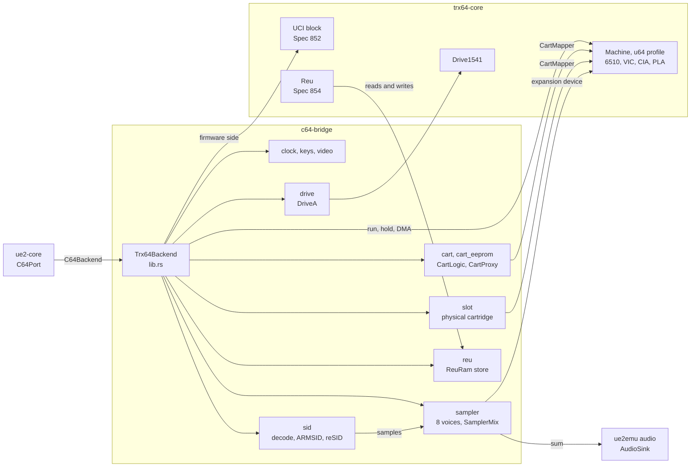

| Module | Role | Doc |
|---|---|---|
| `lib.rs` | `Trx64Backend`: machine built with the `u64` profile before the power-on reset, `advance_to` (clock conversion, CPU run slices, drive check, SID and sampler catch-up), reset and hold (`Hold::Cpu`, `Hold::Reset`), DMA, ROM windows, UCI routing from C64_BUS_INTERNAL, turbo strobe, expansion lines, REU attach and resize | [S14](specs/S14-c64-trx64.md) §3-§7, [S15](specs/S15-uci.md) §3.4 |
| `clock.rs` | 100 MHz clocks to PAL cycles, anchored at attach and after every reset release | [S14](specs/S14-c64-trx64.md) §4 |
| `keys.rs` | 64-entry table from the U64 matrix position to TRX64 key names; host keys OR MATRIX_KEYB | [S14](specs/S14-c64-trx64.md) §6 |
| `video.rs` | 384×272 frame indices, firmware palette, screen codes and character set for `c64_text_dump` | [S14](specs/S14-c64-trx64.md) §9 |
| `sid.rs` | SID decode from the core config latches, ARMSID configuration protocol, reSID engines, write queue, `AudioSink`; S17 adds receiver groups and the mixer | [sid-audio.md](status/sid-audio.md), [S17](specs/S17-ultisid.md) |
| `sampler.rs` | Ultimate Audio: register file, eight voices, mixer, `$DF20-$DFFF` expansion device, its own DDR cell, `SamplerMix` | [S16](specs/S16-ultimate-audio.md), [sampler.md](status/sampler.md) |
| `cart.rs`, `cart_eeprom.rs` | `CartLogic` (all_carts_v5.vhd, freezer.vhd), `CartProxy` as TRX64's `CartMapper` with the forced ULTIMAX decode, the microwire EEPROM; the capability constants CAPAB_EEPROM, CAPAB_COMMAND_INTF, CAPAB_SAMPLER | [carts.md](status/carts.md) |
| `slot.rs` | Physical cartridge: TRX64 mappers, flash boards, or `CartLogic` from the CRT; bus sharing, bridge mirroring, CART_DETECT | [cart-slot.md](status/cart-slot.md) |
| `drive.rs` | `DriveA`: TRX64's drive 8 as a `C64Drive`, parked while held or unpowered, surfaces from DDR GCR, written-track detection | [drive.md](status/drive.md) |
| `reu.rs` | `ReuRam`: TRX64's `ExpansionRam` over guest DDR at `0x1000000`, `None` when nothing is lent | [reu.md](status/reu.md) |

### Host side

Level 2 of `ue2emu`: how the host reaches the machine and what it gets back.

- **`HostInput`** (`Machine::input`):
  - `Key { row, col, down }` → `U64Io::set_key` and `C64Port::set_key` (TRX64's keyboard or the stub's CIA1).
    While the overlay owns the keyboard (TRANSPARENCY bit 6) key-downs do not reach the C64; releases always do.
  - `Joystick(bits)` → `U64Io::set_joystick` and C64 port 2
  - `MenuButton(pressed)` → `Itu::set_menu_button`
  - `UsbKey { usage, down }` → the USB HID keyboard (dropped without `--usb-keyboard`)
  - `UsbPlug { port, connected }` → unplug or plug in the device on a hub port (`usb-replug`, `--usb-dir` replugs)
  - `Restore(held)` → the C64 NMI line
- **Audio** (`ue2emu::audio`, `--audio on|off`, `--audio-wav`): the emulation thread pushes the SID's samples into a
  150 ms ring that drops the oldest samples when full and plays silence on underrun, so `--speed max` never waits;
  the cpal stream lives in `EmuHandle` on the thread that spawned the emulation. The WAV gets every sample.
- **`DisplaySnapshot`:** overlay registers, screen RAM, colour RAM and palette, plus `c64: Option<C64Frame>` (frame,
  palette, text screen and character set of an attached C64). Published by the emulation thread at every VIC picture, or
  every 20 ms emulated without a C64 (S26). `render::Renderer` composites the overlay over the 384×272 C64 frame (overlay only without a C64);
  `render::text_dump` and `render::c64_text_dump` turn the overlay and the C64 screen into text.
- **Window:** realtime, held to the rendered image's ratio on resize, opens at 768×576. F12 = menu button, Page Up = RESTORE; other keys go to
  the matrix, or with `--usb-keyboard` to the USB keyboard.
- **Control:** `--script file` or `--control 127.0.0.1:PORT`, one command per line (S08):
  `wait <ms>`, `button [ms]`, `key <name> [ms]`, `type <text>`, `usbkey <name> [ms]`, `screen`, `c64screen`,
  `png <path>`, `expect <text> [ms]`, `expect-not <text> [ms]`, `expect-console <text> [ms]`,
  `usb-sync [--force] [port]`, `usb-replug [--discard] [port]`, `quit`.
  - `button`, `key`, `type` and `usbkey` reach the emulation thread as one timed sequence (`Command::Inputs`,
    `control::InputTimeline`), so holds keep their emulated length at any host speed.
  - `expect*` poll the screen text or the console; a timeout prints the screen and fails with the line number, and
    a headless script exits non-zero. `scripts/smoke-all.sh` runs the self-checking smoke scripts
    ([tooling.md](status/tooling.md)).
  - `png` reads its font (`chars.bin`) from `--roms` (`ControlHandle::rom_dir`).

  This is how agents, CI and `ue2-mcp` verify the UI without a person.

## 6. Runtime View

### Execution model

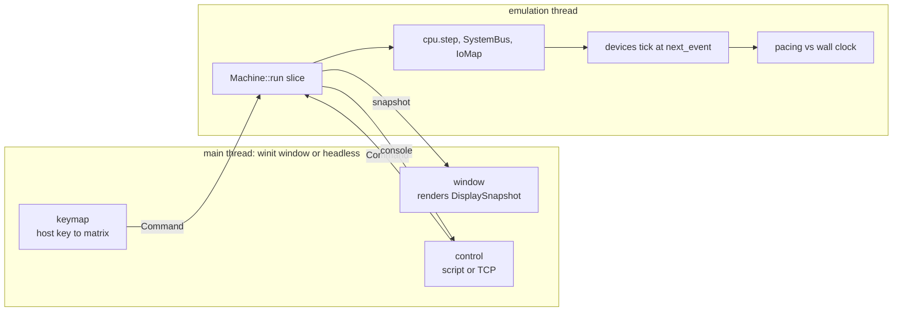

The emulation thread runs `Machine::run` in slices of 100 000 instructions (4 ms emulated at the default 4 clocks per
instruction), cut short at the next timed input. After each slice it drains the console to stdout, processes queued
`Command`s, publishes the `DisplaySnapshot` at every VIC picture (S26), pumps the network backend and paces
([S02](specs/S02-core.md), [tooling.md](status/tooling.md)). Other threads: the cpal stream, the web UI proxy (one
accept thread, one per connection direction), and the `--usb-dir` worker and host watcher. With an audio device the
reSID engines, the mixing and the sink run on the SID worker ([S20](specs/S20-sid-thread.md)); the emulation thread
sends it the SID writes with their cycle.

#### Machine loop

1. `bus.now += clocks_per_insn` for each instruction (default 4 clocks, i.e. 25 MIPS emulated; at least 1, checked by
   clap and `Machine::new`).
2. Before each step:
   - If `now >= next_deadline`, tick every device whose `next_event() <= now`.
   - Set `cpu.meip = bus.irq.line()`.
3. After any IO access (`bus.io_touched`), recompute `next_deadline` as the minimum `next_event` over all
   devices.
4. Breakpoints and fault hooks are checked only when armed. The four fault hooks are PC equal to
   `vAssertCalled`, `C_exception_handler`, `__crt0_dummy_trap_handler`, or the `j .` of the `get_mem` PANIC loop
   (found in the loaded code of `_Z7get_memj`; the halt names the caller from the saved `ra`). An absent hook is
   `NO_HOOK` (`u32::MAX`, never a PC), so the per-step check is four inlined compares ([fixes.md](status/fixes.md)).
5. Idle skip ([S19](specs/S19-idle-skip.md)): where a backward branch or jump lands, `idle_arrival` compares the state
   with the last arrival there. When nothing was written, no IO was accessed, no device ticked, no interrupt was
   taken and registers, CSRs and the period are unchanged, it skips whole passes up to `next_deadline` or the end of
   the budget. The skipped instructions count against the budget and in `idle_insns`, not in `cpu.insns`. Off with
   breakpoints, trace, `--log io` or `--no-idle-skip`.

#### Pacing

- `realtime` (default): every ~100 k instructions, compare emulated ms with wall-clock ms and sleep when
  ahead. Timers, UI key repeat and network timeouts then behave like hardware.
- `max`: run as fast as possible. Tests use emulated-time waits.

### Firmware boot

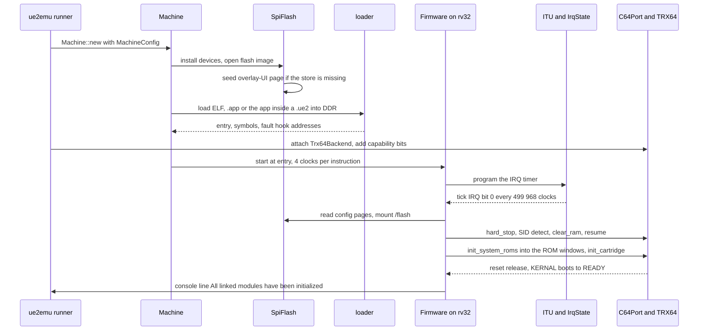

- There is no boot loader stage: the loader copies the application into DDR and the CPU starts at its entry
  (`0x00030000` for the ELF). The boot BRAM page `0x8000xxxx` reads 0. The flash holds config pages, the `/flash`
  FAT volume and, after `install`, the FPGA image and the application slot, but `run` does not boot from it.
- `--c64-roms` writes KERNAL, BASIC and CHAR into `/flash/roms` before the machine opens the image; without them a
  blank flash shows the firmware's placeholder KERNAL ([c64.md](status/c64.md)).
- Order of the C64 part: `hard_stop` → SID detect (chips-only raster) → `clear_ram` (MEMONLY 64 KB) → resume; then
  `init_system_roms` → `init_cartridge` (MODE←RESET, TYPE←0, KILL←2 ×2, MODE←UNRESET, STOP←0); warm reset → KERNAL
  → `READY.` about 3 s emulated later ([S14](specs/S14-c64-trx64.md) §7).
- Boot log, task list and stats: [boot.md](status/boot.md).

### C64 register access and DMA

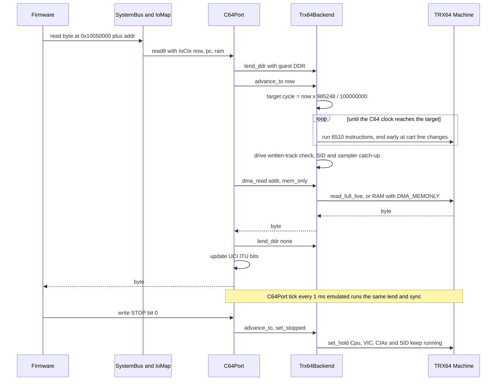

- The C64 never runs ahead of the RV32. Whole 6510 instructions run, the overshoot is carried, so DMA lands on
  instruction boundaries; the firmware stops the C64 first and cannot observe the difference.
- HAS_STOPPED equals the request at once for every STOP_MODE. While stopped, TRX64 runs the chips
  (`Machine::set_hold(Hold::Cpu)`), which `DetectSidImpl`'s `$D012` poll and the Freeze UI need.
- Details: [S14](specs/S14-c64-trx64.md) §4-§5, [Emulated time](#emulated-time-and-clocking), [DDR lending](#ddr-lending).

### UCI command round trip

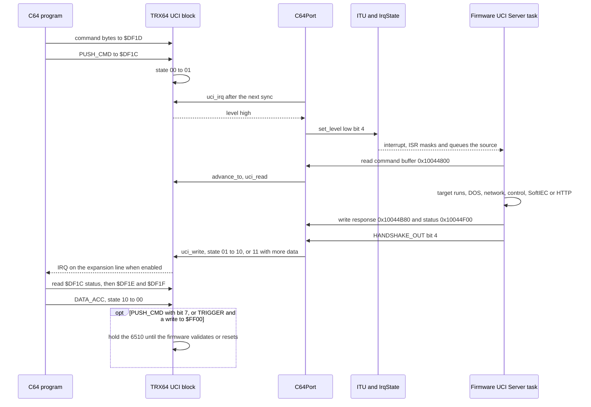

- The block is TRX64's (Spec 852 on the `u64` profile); the targets are firmware and run unmodified. UE2 maps the
  firmware window, drives the ITU bits and routes the block from C64_BUS_INTERNAL.
- ITU low bit 4 is recomputed after every UCI access, after every backend sync and in `tick`.
- The window sits at `$DF18-$DF1F` by default, `$DFF8-$DFFF` for the SID/MUS players, `$DE18-$DE1F` for EasyFlash.
- Details: [S15](specs/S15-uci.md); end-to-end check `uci-targets` in [e2e.md](status/e2e.md).

### Audio

Several SID engines and the mixer land with [S17](specs/S17-ultisid.md); until then one reSID serves socket 1 and
UltiSID 1.

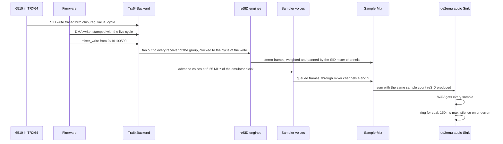

- reSID stays the clock master. `Sid::catch_up` is untouched by S16: the sampler mixes behind it, as the sink reSID
  pushes into ([S16](specs/S16-ultimate-audio.md) §3.4).
- The sampler engine runs on emulated time even with no sink, so `audio_detect()` sees its status bit
  ([sampler.md](status/sampler.md)).
- Without a sink, CPU writes only set registers and a DMA access clocks the gap (at most 1 s); reSID is never
  clocked with `clock_silent` ([sid-audio.md](status/sid-audio.md)).
- Byte 2c of a mixer channel is its left gain, 2c+1 its right, each / 90, so the boot default `5A/5A` is unity on
  both sides; the drive and tape channels have no source ([S29](specs/S29-stereo.md)) ([S17](specs/S17-ultisid.md) §2.5).

### MCP-driven test run

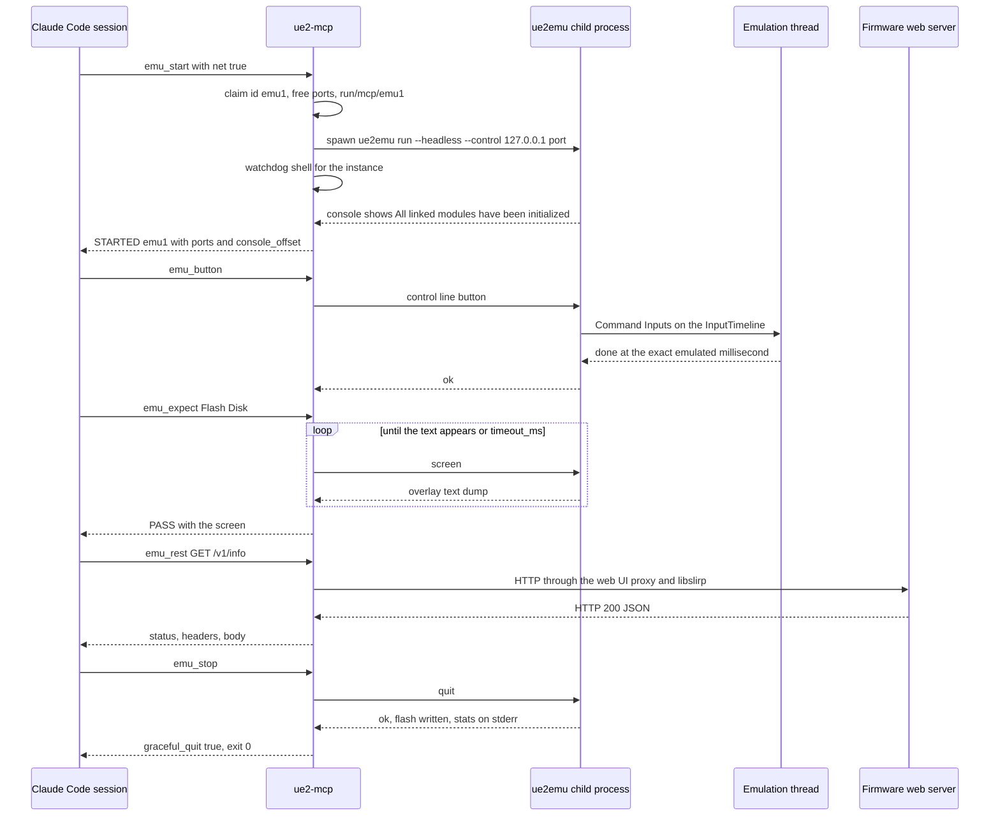

- Waits are emulated time, `timeout_ms` is wall clock. A failed assertion is a normal result starting `FAIL:`.
- If the server dies, the watchdog sends `quit` so the flash is still saved, then SIGTERM/SIGKILL.
- Tools, parameters, flash modes and the direct protocol: [mcp.md](status/mcp.md).

### Install

`ue2emu install --update X.ue2 --flash F [--yes] [--timeout S] [--c64 trx64|none] [--roms DIR]` populates a flash
image the way hardware gets its contents ([install.md](status/install.md)):
- `loader::load_updater` loads the updater record of the `.ue2` with the normal device set; no overlay-UI seed.
- The updater's UI is the C64 text screen. `install.rs` reads its popups through `C64Port::dma_peek` and answers
  them with matrix keys through `Machine::input`, with TRX64 or the T0 stub.
- The run ends at the updater's power-off request to the ESP32 stub (`U64Ctrl::power_event`). The flash image is
  written, and the application slot is compared with the update file.

## 7. Deployment View

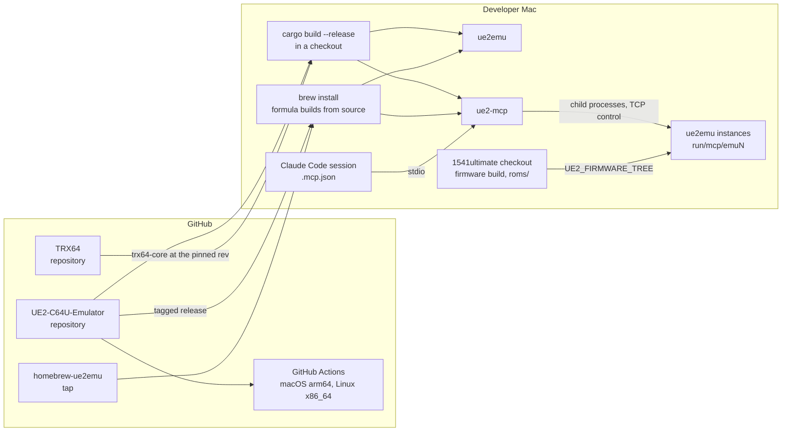

| Node | What runs there | Doc |
|---|---|---|
| Checkout | `cargo build --release -p ue2emu -p ue2-mcp`; prerequisites Rust stable, a C++ compiler, libslirp, network on the first build; optional `firmware/1541ultimate` and `tools/bin` for `scripts/build-firmware.sh`. `UE2_FIRMWARE=… cargo test --workspace`, `scripts/smoke-all.sh` | [install.md](status/install.md) §1 |
| Homebrew | `brew install jondalar/ue2emu/ue2emu` builds the tagged release from source with Homebrew's Rust and libslirp and installs `ue2emu` and `ue2-mcp` (tap https://github.com/Jondalar/homebrew-ue2emu). An installed `ue2emu` always needs `--roms`; an installed `ue2-mcp` starts the `ue2emu` next to it and keeps instances in `~/.ue2emu/run/mcp/` | [install.md](status/install.md) §1, §6 |
| CI | [ci.yml](../.github/workflows/ci.yml) on pushes to main, pull requests and by hand: macos-latest (libslirp from Homebrew), ubuntu-latest (`libslirp-dev`, `libasound2-dev`, `pkg-config`) and windows-latest (libslirp from vcpkg, cached); `cargo build --workspace --locked`, `cargo test --workspace --locked`. No firmware and no ROMs, so those tests skip. [release-binaries.yml](../.github/workflows/release-binaries.yml) builds the Windows zip for a published release | [install.md](status/install.md) "Platforms" |
| MCP beside the emulator | `ue2-mcp` registered in the project that uses the emulator (`.mcp.json` or `claude mcp add`); env `UE2_REPO`, `UE2EMU_BIN`, `UE2_FIRMWARE_TREE`, `UE2_MCP_RUN`. Each instance is a child `ue2emu run --headless --control 127.0.0.1:<port>` with its own run directory and free localhost ports; several servers share `run/mcp` through claim files | [mcp.md](status/mcp.md) |
| E2E | `scripts/run-e2e.sh` boots a realtime emulator with forwards (REST 18080, FTP 18021, Telnet 18023, DMA 18064, passive FTP 51000-52999) and runs the firmware tree's `run-tests` with `U64_*_PORT`; `E2E_REST_SHIM=1` for suites that ignore the port | [e2e.md](status/e2e.md) |
| Network modes | `user`: no privileges, guest 10.0.2.15. `vmnet-bridged`: root or the vm.networking entitlement. `socket-vmnet`: a socket_vmnet daemon running as root | [network.md](status/network.md) |

The workspace version is 0.2.0 ([Cargo.toml](../Cargo.toml)).

## 8. Cross-cutting Concepts

### Emulated time and clocking

- **Master clock.** 100 MHz (`crates/ue2-core/src/time.rs`), advanced by `clocks_per_insn` per instruction (default 4,
  25 MIPS emulated). Loops at a fixed point are fast-forwarded to the next device event, and the run ends in the same
  state as without the skip ([S19](specs/S19-idle-skip.md)).
- **Devices** schedule themselves through `next_event`/`tick`. The ITU IRQ timer raises edge bit 0 every
  `(reload+1)*256` clocks (0x7A0 → 499 968, the 200 Hz tick); ITU_TIMER counts 1 per 500 clocks; the ms timer is
  `now / 100 000` ([S03](specs/S03-itu-uart.md)).
- **C64 cycles.** The C64 runs from the PAL master clock, 985 248 Hz: `cycles(now) = now × 985 248 / 100 000 000` in
  u128 from the attach clock. 1 cycle = 101.497 clocks = 25.4 RV32 instructions; 1 PAL frame = 19 656 cycles ≈
  19.95 ms. The 0.6 ppm drift is ignored.
- **1 ms sync.** The C64 never runs ahead of the RV32. Periodic: `C64Port::next_event() = synced + 100 000` (1 ms,
  about 985 cycles). Lazy: each access to the cart registers, the DMA window, MATRIX_KEYB, the UCI window and drive A
  first calls `advance_to(ctx.now)`, so polls see the C64 at the exact RV32 instant.
- **Instruction boundaries.** The backend runs whole 6510 instructions up to the target and carries the overshoot (at
  most about 7 cycles plus a BA steal). With a cartridge, runs end where EXROM/GAME can change: TRX64's access watch on
  `$DE00-$DFFF`, the Epyx capacitor deadline, single instructions while a freeze waits for the interrupt.
- **Stop and reset.** STOP is `Hold::Cpu`: VIC, CIAs and SID run on. A held reset is `Hold::Reset`, and the reset wins.
  The bridge keeps the Epyx capacitor hold time and drive A clocking. TRX64's reset zeroes its clock, so the bridge
  re-anchors after every release ([S14](specs/S14-c64-trx64.md) §4, §7, [S15](specs/S15-uci.md) §3.4).
- **Audio clocks.** reSID follows the C64 cycles; the sampler engine runs at 6.25 MHz = `CLOCK_HZ / 16` and is
  resampled to the sink rate.
- **Host time.** Snapshots at every VIC picture (every 20 ms emulated without a C64); control inputs applied at exact emulated milliseconds; every wait in
  scripts, the control protocol and MCP is emulated time; the pacer and MCP's `timeout_ms` are wall clock.

### Device model: bus, IoMap and devices

- **`SystemBus`** implements `rv32::Bus`:
  - bit 28 = 0 → `ram[addr & RAM_MASK]`, with a fast path for 32-bit words. Exception: the boot BRAM page
    `0x8000xxxx` reads 0 and ignores writes, because the ELF is loaded directly (00 §1 bus rules).
  - Instruction fetches ignore bit 28: every page except `0x8000xxxx` fetches from DDR.
  - `0x10000000-0x10FFFFFF` → `IoMap`.
  - Anything else → read 0 / write ignored, reported to the unmapped log.
  - 16/32-bit IO accesses are split into LE bytes.
- **`IoMap`:** 256-byte decode grain. `add(base, size, Box<dyn IoDevice>)` maps a device's primary window;
  `map(base, size, idx)` adds alias windows. A device sees offsets relative to the window it was accessed
  through. `map_origin(base, size, idx, origin)` maps a window whose offsets count from `origin`, so one device
  can tell several windows apart. `get_mut::<T>()` downcasts, so the machine can deliver host input. Overlapping
  windows panic at install, and a test installs all modules.
- **`IoDevice`:** `read8`, `write8`, `peek8`, `next_event`, `tick`, `reset`. Each call gets an `IoCtx`:
  `now`, `pc`, `ram` (for DMA masters), `irq`, and `console`. `peek8` has no side effects; the GDB stub uses it.
- **`IrqState`:** the ITU interrupt core (global enable, mask, edge mask `0x85`, latched flags, level
  sources, high enable/sources). Devices only drive sources: `pulse(bit)`, `set_level(bit)`,
  `set_high(bit)`. The ITU device owns the register view. `line()` is a few bit ops, so it is evaluated
  on every instruction. A level source must drop once the firmware acks, or the ISR storms (WiFi high bit 3, UCI high
  bit 6).
- **`devices::install_all`** calls one `install(map, cfg)` per device module. Each module owns its windows. Simple
  T0 windows are `add_table` register tables (constant, latch, RAM, RAZ/WI per offset).
- **Tiers.** T0 is the model needed to boot to the UI loop without hanging; T1 is the functional model
  ([hw/00](hw/00-memory-map.md) §1, "Emulator model tiers"). Tests are named after the hazard they cover
  (`c12_stop_ack_immediate`, …).

### The C64Backend trait

`crates/ue2-core/src/c64host.rs` holds `C64Backend`, `C64Frame`, `C64Rom`, `C64Drive`, `C64CartSlot` and `UciEvents`.
It has no TRX64 types.

- **Why a trait in ue2-core, with the cargo feature on ue2emu only** ([S14](specs/S14-c64-trx64.md) §2): `trx64-core`
  compiles reSID C++ and brings more crates; ue2-core must keep building and testing with no C++ toolchain and no
  TRX64; `C64Port` is unit-tested with a mock backend; `--no-default-features` builds a T0-only ue2emu.
- **Required methods** (phase A): `advance_to`, `set_reset`, `set_stopped`, `set_ultimax`, `set_nmi`, `dma_read`,
  `dma_write`, `dma_peek`, `rom_write`, `rom_read`, `set_cart`, `kill_cart`, `cart_active`, `set_palette_byte`,
  `set_key`, `set_matrix_keyb`, `set_joystick`, `frame`.
- **Defaulted methods**, added per feature so other backends and the mock keep compiling and `--c64 none` is unchanged:

  | Added by | Methods |
  |---|---|
  | W4-SID | `core_config_write` |
  | W4-CART | `lend_ddr`, `eeprom_read`, `eeprom_write`, `set_freeze_button` |
  | W4-DRIVE | `drive` |
  | `--cart-slot` | `cart_detect`, `cart_slot` |
  | REU | `set_reu_enabled`, `set_reu_size_kb`, `reu_attached` |
  | S15 | `has_uci`, `uci_read`, `uci_write`, `uci_irq`, `uci_take_events` |
  | S16 | `has_sampler`, `sampler_read`, `sampler_write`, `set_sampler_enabled` |
  | S17 | `mixer_write` |

- Reads that the firmware side can peek (`uci_read`, `sampler_read`) take `&self`, so `peek8` uses the same call.

### DDR lending

- The FPGA's cartridge logic, REU and sampler read the same SDRAM the firmware writes. UE2 does not copy it:
  `C64Port` lends `IoCtx::ram` to the backend (`lend_ddr(Some)`) before every sync and every tick and takes it back
  (`lend_ddr(None)`) before it returns; `ctx.ram` is only read in between.
- `CartLogic` serves ROM from DDR `0x03C00000` (22 cart bits), cart RAM from `0x00EF0000` and GeoRAM from
  `0x01000000` live, so EasyFlash writes land in the firmware's image of the cartridge.
- TRX64 holds its REU store for the life of the device, but a borrow cannot be held. `ReuRam` is a second shared
  pointer cell updated on the same lend; the sampler has its own cell of the same shape. When nothing is lent the
  store answers `None` and the device drives its own floating bus ([reu.md](status/reu.md)).
- Drive A's `DriveRegs` lends DDR around its C64 sync and takes it back before it uses `IoCtx::ram` itself: the drive
  ROM (`0x00EE8000`) and the GCR half-tracks go to the drive, written tracks and the drive RAM mirror (`0x00EE0000`)
  come back.
- `dma_peek` has no DDR lent, so cartridge ROM windows read as unserved there ([carts.md](status/carts.md)).

### Debugging

- Symbolized logs (ELF symbols, C++ demangled).
- `--log unmapped,io,irq`: first hits per unmapped address with PC and symbol, a full IO trace, IRQ edges.
- Fault hooks halt with a symbolized backtrace hint (ra); the `get_mem` hook names the caller whose allocation failed.
  `--no-halt` keeps running. `.app` and `.ue2` images have no symbols and get no hooks.
- CPU trace ring (`--trace`, implied by `--gdb`): the PCs of the last 256 steps, printed with symbols when a
  fault hook halts the machine (`monitor trace` in GDB). It costs about 3 % of host MIPS when on and nothing
  measurable when off.
- GDB remote stub (`--gdb 127.0.0.1:1234`, `riscv32-unknown-elf-gdb`, S11, `ue2emu/src/gdb.rs`,
  [gdb.md](status/gdb.md)):
  - The machine waits at reset until the debugger continues; a debugger attaching later stops it where it is.
  - x0-x31 and pc; memory reads without side effects (IO through `peek8`, ITU registers included), memory writes to
    DDR only.
  - Software breakpoints (`Machine::breakpoints`), step, continue, Ctrl-C. A fault hook stops GDB with SIGABRT.
  - Detach lets the machine run on; kill ends the emulator.
  - `monitor tasks` lists the FreeRTOS tasks from `pxCurrentTCB` and the kernel lists.

### Errors and faults

- The bus has no faults: unmapped reads return 0 and writes are ignored, both logged with `--log unmapped`.
- A fault hook or an illegal instruction ends the run with `RunExit::Halted`; the runner prints the message and the
  stats. An `ue2-mcp` instance that halted stays listed, so its console and stderr can be read.
- A control script names the failing line; a timed-out `expect*` prints the screen first; a headless run exits
  non-zero. Over TCP the client gets `error line <n>: …`.
- Start-up refuses bad combinations with a message: `--clocks-per-insn 0`, a taken `--web-port`, vmnet without root,
  a shared `--usb-dir`, an unsupported CRT type, config file errors ([install.md](status/install.md) §4,
  [network.md](status/network.md), [usb-dir.md](status/usb-dir.md), [cart-slot.md](status/cart-slot.md)).
- `install` exits 0 only when the updater switched the machine off and the flash check passes.

### Configuration

- **Command line.** `ue2emu run` and `ue2emu install` take clap options; `MachineConfig` carries them into the
  machine ([install.md](status/install.md) §3).
- **TOML.** `run --config FILE.toml` turns the file's keys (the long flag names) into flags and parses the command line
  again. The command line wins per flag; relative paths resolve against the file's directory; `~` expands; unknown
  keys and wrong value kinds are errors. `docs/examples/ue2emu.example.toml` is checked by a test
  ([install.md](status/install.md) §4).
- **Capabilities.** Without `--caps` the frontend ORs in the bits of what is attached (network, USB, EEPROM, UCI,
  sampler). An explicit `--caps` is used as given (`MachineConfig::capabilities_explicit`).
- **Firmware settings** live in the flash image the firmware writes. The emulator seeds only the overlay-UI page
  ([S06](specs/S06-spi-flash.md)) and, on request, the C64 ROM files (`--c64-roms`).

### Persistence and write-back

| Data | Rule | Doc |
|---|---|---|
| Flash image | Created erased if missing; written back after program/erase, debounced (about 0.5 s wall), and on a clean exit. `quit` and closing the window are safe, a kill inside the window loses the last save | [storage.md](status/storage.md) |
| SD image | Writes go straight to the file; opened once, no hot-plug | [storage.md](status/storage.md) |
| Drive A disks | The drive writes GCR into DDR with DIRTY set; the firmware writes the image | [drive.md](status/drive.md) |
| Physical cartridge | `ro` by default; `rw` writes into the CRT with a `.bak`, `save=` into another file | [cart-slot.md](status/cart-slot.md) |
| `--usb-dir` | Nothing on the host is deleted or overwritten without a copy: trash, conflict copies, a mass-deletion guard, no sync of an image that fails the parse check, resume after a crash | [usb-dir.md](status/usb-dir.md) |

### Testing

- **Unit tests** per crate: rv32 against the riscv-tests; each device against its `docs/hw` behaviour with hazard-ID
  names; `C64Port` with a mock backend; the bridge against TRX64 (tests that need ROMs or the ELF skip without them).
  `cargo test -p ue2-core` never builds TRX64.
- **Control-script smokes.** `scripts/smoke-all.sh` builds, runs menu, sd, flash-1, flash-2 and a negative control in
  a temporary directory ([tooling.md](status/tooling.md)). C64 smokes with their setup in the header: `smoke-c64-roms`,
  `-ready`, `-type`, `-prg`, `-freeze`, `-carts`, `-drive`, `smoke-sid-tone` with `wav-tone.py`
  ([c64.md](status/c64.md)). USB: `smoke-usb.ctl`, `smoke-usb-dir.sh`. MCP: `scripts/mcp-smoke.py`. Some C64 scripts
  still rely on `grep` of the dumps, not on `expect`.
- **Upstream E2E.** `scripts/run-e2e.sh smoke|quick` runs the firmware tree's suite against a booted emulator, plus a
  second pass for `uci-targets` ([e2e.md](status/e2e.md)).
- **CI** builds and tests the workspace on macOS and Linux ([Deployment View](#7-deployment-view)).
- **Performance** is measured on M2: `wait 60000`, `--log unmapped`, `--speed max`, one run at a time
  ([c64.md](status/c64.md) §Performance).

### Change discipline

[CLAUDE.md](../CLAUDE.md) and [AGENTS.md](../AGENTS.md) require a GitNexus impact analysis before a function is edited
and a change detection before a commit; HIGH and CRITICAL risk is reported, UNKNOWN is not read as safe. The specs
record where this shaped the design: S16 left `Sid::catch_up` unchanged (CRITICAL, 22 impacted symbols) and mixed the
sampler behind it; S17 keeps `run_cpu` and `run_held` unchanged (CRITICAL, 25 symbols).

## 9. Architecture Decisions

| Decision | Reason, rejected alternative | Record |
|---|---|---|
| Run the firmware unmodified; adapt the emulator, defects included | The point is to test the real firmware | [hw/00](hw/00-memory-map.md) §"Firmware defects" |
| Load the application straight into DDR; no boot ROM or flash boot | Loading it directly replaces the boot ROM (hw/01 §A, H18); the boot BRAM page reads 0 | [S02](specs/S02-core.md), [hw/01](hw/01-cpu-boot-memory.md) |
| Emulated time advances per instruction, fixed clocks per instruction | The idle task spins without WFI. Loops that cannot change anything are skipped to the next device event, exactly (S19) | [S02](specs/S02-core.md), [S19](specs/S19-idle-skip.md) |
| Fault hooks as plain `u32` compares with `NO_HOOK` | About 12 % faster loop than the closure check | [fixes.md](status/fixes.md) §1 |
| TRX64 as the C64 core behind a `C64Backend` trait in ue2-core, linked by a cargo feature | ue2-core builds without C++ and TRX64, mock tests, T0-only build | [S14](specs/S14-c64-trx64.md) §2 |
| One `C64Port` device through `IoMap::map_origin` | Several devices sharing `Rc<RefCell<backend>>` would split one state machine (STOP, MODE, cart) | [S14](specs/S14-c64-trx64.md) §2 |
| C64 sync lazily on access plus a 1 ms tick; DMA on instruction boundaries | The firmware always stops the C64 before DMA | [S14](specs/S14-c64-trx64.md) §4 |
| TRX64 as a pinned git dependency | Replaced a path dependency and a build.rs rev check | [S14](specs/S14-c64-trx64.md) (changes), [install.md](status/install.md) "TRX64 dependency" |
| TRX64 reverse rings off (`TRX64_CPUHISTORY=0`, one-entry rings) | 112 MB RSS and a per-instruction cost | [S14](specs/S14-c64-trx64.md) §7, [c64.md](status/c64.md) §Performance |
| Cartridge logic ported from all_carts_v5.vhd, served from lent guest DDR | Flash writes land in the firmware's image; no copies | [S14](specs/S14-c64-trx64.md) §W4-CART, [carts.md](status/carts.md) |
| An ARMSID as the socket-1 chip; socket 1 empty by default | Detection needs no cycle timing; a fitted default shows a first-boot popup | [sid-audio.md](status/sid-audio.md) |
| Drive A: the firmware owns the image formats, UE2 moves GCR between DDR and TRX64's drive | The firmware already converts D64/G64 to GCR in DDR and saves written tracks back | [S14](specs/S14-c64-trx64.md) §W4-DRIVE |
| The UCI block lives in TRX64 (Spec 852); UE2 maps the window and drives the ITU bits | A ue2-core model and a fake `CartProxy` are not needed | [S15](specs/S15-uci.md) §4, [trx64-uci-requirements.md](specs/trx64-uci-requirements.md) |
| ITU high IRQ 6 dropped on the firmware's `$D038` write | The ITU has no ack register | [S15](specs/S15-uci.md) §3.3 |
| The REU is TRX64's `Reu` over the firmware's DDR (`ExpansionRam`, Spec 854) | A private 16 MB copy would miss every preload | [reu.md](status/reu.md) |
| The sampler is built in UE2; it mixes behind reSID, runs on emulated time and is asked before the REU | It is FPGA hardware; `Sid::catch_up` is CRITICAL; TRX64's REU mirrors `$DF20-$DFFF` | [S16](specs/S16-ultimate-audio.md) §3, [sampler.md](status/sampler.md) |
| Several SIDs: TRX64 Spec 855 gives SID handles, a map, a write trace and a read door; UE2 does the U64 decode, groups, engines and the mixer | TRX64 routes an address to one chip, the U64 to every decoder that hits | [S17](specs/S17-ultisid.md) |
| An explicit `--caps` is used as given | Otherwise a machine without EEPROM, UCI or the sampler cannot be modelled | [sampler.md](status/sampler.md) §Known gaps, [install.md](status/install.md) §3 |
| Control inputs as timed sequences on the emulation thread | An `at_ms` from the control thread shortens holds under load | [tooling.md](status/tooling.md) |
| `install` runs the updater instead of copying the application | Hardware gets its flash contents that way | [install.md](status/install.md) §5 |
| `--c64-roms` writes the ROMs into `/flash/roms` before boot | No updater writes them; replaces the menu steps | [c64.md](status/c64.md), [install.md](status/install.md) §2 |
| Web UI proxy rewrites `location.hostname` to `location.host` | The UI builds API URLs without a port; port 80 needs root | [network.md](status/network.md) |
| `--usb-dir` builds a FAT32 image and syncs back under safety rules | The host directory holds user files | [usb-dir.md](status/usb-dir.md) |
| `ue2-mcp` drives child processes over the TCP control protocol, with a watchdog | The tools are a layer over a protocol scripts can use directly; an orphaned instance still quits cleanly; several servers share one run base | [mcp.md](status/mcp.md) |
| Homebrew formula builds the tagged release from source | Uses Homebrew's Rust and libslirp | [install.md](status/install.md) §1 |

## 10. Quality Requirements

### Quality tree

| Quality | Refinement | Scenario |
|---|---|---|
| Fidelity | Boot | Q1, Q2 |
| Fidelity | Services and C64 | Q3, Q4, Q5 |
| Performance | Throughput | Q6, Q7 |
| Performance | Realtime | Q8 |
| Testability | Headless, self-checking | Q9, Q10 |
| Data safety | Host files | Q11 |
| Maintainability | Build isolation | Q12 |

### Scenarios

| # | Scenario | Measured | Record |
|---|---|---|---|
| Q1 | M2: the upstream ELF runs 60 s emulated | No halt, PC in `prvIdleTask`, 0 unmapped addresses (M1: 166 s, also 0) | [boot.md](status/boot.md) |
| Q2 | `install` of the upstream `update.ue2` | Power-off request after 15.692 s emulated, application identical to the update file, 5.3 s wall | [install.md](status/install.md) §5 |
| Q3 | Upstream E2E suite | smoke 12 of 12 with the REST shim; `uci-targets` 46 checks OK | [e2e.md](status/e2e.md) |
| Q4 | C64 acceptance | A2 `READY.`, A3 ` 42`, A4 PRG run, A5 Freeze UI; 27 cartridge types PASS; drive A LOAD and SAVE with write-back | [c64.md](status/c64.md) |
| Q5 | SID tone typed in BASIC | WAV dominant 1000.0 Hz, PASS | [sid-audio.md](status/sid-audio.md) |
| Q6 | M2 at `--speed max` | `--c64 none` about 208 host MIPS (7.2 s wall); `--c64 trx64` about 124 (12.1 s); drive A, ARMSID and WAV about 111 (13.5 s) | [status/README.md](status/README.md) |
| Q7 | S14 budget | `--c64 trx64` ≥ 100 host MIPS and ≤ 15 s wall for M2, peak RSS within 60 MB of `--c64 none`; `--c64 none` within 3 % of pre-S14 (212.5 vs 202 MIPS median) | [S14](specs/S14-c64-trx64.md) §12 A6, [c64.md](status/c64.md) |
| Q8 | Realtime, 60 s | Needs 25 MIPS; with drive A, ARMSID and the audio device 26 % of one core; the pacer fell behind by 0.3 s at most over the minute | [c64.md](status/c64.md) |
| Q9 | Smoke suite | `smoke-all.sh` passes; the negative control exits non-zero and names the line | [tooling.md](status/tooling.md) |
| Q10 | Input timing under load | 46 of 46 holds exactly 80 ms with 10 busy loops on 10 CPUs | [tooling.md](status/tooling.md) |
| Q11 | Guest deletes files on a `--usb-dir` stick | Moved to `.ue2-trash`; more than 25 % or more than 50 deletions refused until forced | [usb-dir.md](status/usb-dir.md) |
| Q12 | Build without TRX64 | `cargo build -p ue2emu --no-default-features` clean; `cargo test -p ue2-core` without a C++ toolchain | [c64.md](status/c64.md) |
| Q13 | Realtime, C64 turbo 64 MHz | UltimateDemo2026, four 15 s windows on an Apple M4: realtime in each at 58-72 % of a core on 0.3.2 (TRX64 856 + 857, S19, S20); 69-97 % at TRX64 856 alone; before it, 0.72 to 0.98 of realtime at 100 % | [xander-tests.md](status/xander-tests.md) §2 |
| Q14 | Idle skip changes nothing but speed | Firmware 60 s emulated, with and without TRX64: console, registers, CSRs, `now`, all DDR and the C64 frame identical with the skip on and off; 96.8 % of instructions skipped. UltimateDemo2026 at `--speed max`: 129.0 s CPU instead of 153.3 s | [S19](specs/S19-idle-skip.md), [xander-tests.md](status/xander-tests.md) §2 |
| Q15 | reSID on its own thread | heartbeat-demo (8 SIDs, 64 MHz turbo) at `--speed max`: 102.2 s wall instead of 116.6 s for 131 s emulated, CPU time 118.6 against 116.3 s | [S20](specs/S20-sid-thread.md) §9 |

Other numbers: the CPU interpreter targets ≥ 150 MIPS ([S01](specs/S01-cpu-rv32.md)); the trace ring costs about 3 %;
realtime with 2004 host forwards keeps 25 MIPS at about 24 % of one core ([e2e.md](status/e2e.md)).

## 11. Risks and Technical Debt

| Risk or debt | Effect | Record |
|---|---|---|
| Closed U64-II FPGA top level | Bus sharing, UCI gating, the SID mixer, sampler generics, BOARDREV and the capability word are inferred | [boot.md](status/boot.md), [S15](specs/S15-uci.md) §6, [S16](specs/S16-ultimate-audio.md) §6, [S17](specs/S17-ultisid.md) §5 |
| The bridge drives TRX64 internals | A TRX64 change can break the build or behaviour; the pin, tests and C64 smokes guard it | [install.md](status/install.md) "TRX64 dependency" |
| TRX64's UCI read advances `stalled_on_bus + 1` | UBoot64 stalls reading an existing file; reported to TRX64, not worked around | [xander-tests.md](status/xander-tests.md) |
| 50/60 Hz outside the C64 | The C64 runs NTSC or PAL (S25); overlay, redraw and the UDP stream assume 50 Hz | [c64.md](status/c64.md) §Known gaps |
| Stops and DMA on instruction boundaries | STOP_MODE latched only, always "Frozen on Bad line"; raster-timed programs may glitch on freeze | [c64.md](status/c64.md), [carts.md](status/carts.md) |
| SID gaps after S17 | RES/DIGI/filter curves, socket 2 chip, VOICE_ADSR; `$DE00-$DFFF` precedence unverified | [S17](specs/S17-ultisid.md) §3, §5 |
| Sampler gaps | No read pipeline, no memory contention, REU mirror answers a closed window | [sampler.md](status/sampler.md) |
| Drives | 1541 only; the IEC processor's master mode (printer, UltiCopy) not run | [drive.md](status/drive.md) |
| No pointing device reaches the C64; "Run Cart" leaves the keyboard with the menu | Mouse-driven software (GEOS) cannot be used; cartridges need a button press | [xander-tests.md](status/xander-tests.md) |
| TRX64 cartridge API gaps | No cart ROM in the VIC view; cart writes only in mapped windows; Business Basic's dynamic mode off | [carts.md](status/carts.md) |
| Physical slot model | Bridge bit 0 only, no port timing, freeze button of a slot freezer not wired | [cart-slot.md](status/cart-slot.md) |
| Overlapping REST connections reset | E2E rest-api-coverage varies; root cause not isolated | [e2e.md](status/e2e.md) E5 |
| Network | No link notion on `NetBackend`; multicast dropped (no mDNS); WiFi link always down | [network.md](status/network.md), [boot.md](status/boot.md) |
| Flash and updater stubs | Flash protection not modelled; ESP32 flash discarded; `run` ignores power requests | [install.md](status/install.md) §5 |
| USB and SD | Root port never detaches; no mouse or other classes; no SD hot-plug | [usb.md](status/usb.md), [storage.md](status/storage.md) |
| REU | Preload and save paths not run end to end; IO2 conflicts with cartridges left to the firmware | [reu.md](status/reu.md) |
| Keyboard ownership guessed (05 OQ6) | Host key-downs do not reach CIA1 while the overlay owns the keyboard | [c64.md](status/c64.md) |
| Window and audio device not checked by agents | Realtime window paths verified headless only | [c64.md](status/c64.md), [sid-audio.md](status/sid-audio.md), [tooling.md](status/tooling.md) |
| C64 smokes with a fixed wait and no `expect` | Exit 0 with a garbage dump on a heavier flash; read the greps | [c64.md](status/c64.md) §UCI |
| Control protocol limits | No memory peek, no status query, no wait-for-text | [mcp.md](status/mcp.md) |
| Platforms | Linux not used interactively; Windows unsupported | [install.md](status/install.md) |

## 12. Glossary

| Term | Meaning |
|---|---|
| U64-II | Ultimate 64 Elite II, the FPGA C64 board whose firmware is GideonZ/1541ultimate, target `u64ii/riscv/ultimate` |
| C64U | Commodore C64 Ultimate; its firmware 1.1.0 (`c64u_v1.1.0.ue2`) runs in UE2 too |
| UE2 | This emulator, UE2-C64U-Emulator: the board around the firmware in place of the FPGA; binaries `ue2emu`, `ue2-mcp` |
| TRX64 | The Rust C64 emulator (https://github.com/Jondalar/TRX64), crate `trx64-core`, used as the C64 |
| rvlite | Gideon's RISC-V core: RV32I, Zicsr, the multiply half of M, M-mode only |
| DDR | The board's 64 MB RAM at address 0; also holds CRT banks, REU memory and GCR tracks |
| ITU | The FPGA's interrupt, timer and UART block at `0x10000000`; one interrupt line into the CPU |
| DMA | Direct memory access. The firmware reads and writes the C64 bus through `0x10050000-0x1005FFFF`; the sampler voices and the network, WiFi and USB buffers also read DDR themselves |
| T0 / T1 | Model tiers in `docs/hw`: T0 boots to the UI loop without hanging, T1 is functional |
| Overlay | The FPGA character generator that draws the firmware menu over the video (`0x10140000`) |
| MATRIX_KEYB | `0x10100300`, the key matrix the firmware writes (USB keyboard, RESTORE, freeze button) |
| Capability word | ITU bytes `0x1000000C-F`, bits for the FPGA features the firmware may use |
| PLA | The C64's memory-map logic: from `$01`, EXROM and GAME it decides what the CPU sees |
| EXROM, GAME, ULTIMAX | Cartridge lines into the PLA; ULTIMAX is GAME low with EXROM high |
| IO1, IO2 | The cartridge I/O areas `$DE00-$DEFF` and `$DF00-$DFFF` |
| φ2 (PHI2) | The C64 system clock phase; CLOCK_DETECT bit 0 reports it |
| PAL | The C64 timing UE2 runs: 985 248 Hz, 19 656 cycles per frame |
| UCI | Ultimate Command Interface: registers at `$DF1B-$DF1F` (by default) through which a C64 program sends commands to firmware targets |
| REU | RAM Expansion Unit; on the U64 DDR at `0x1000000`, up to 16 MB |
| GeoRAM | Paged RAM cartridge, served by the cart logic from the same DDR region |
| SID | The C64 sound chip (6581, 8580) |
| UltiSID | The U64's FPGA SID emulation; two of them, each split into up to four instances A-D |
| ARMSID | An ARM-based SID replacement chip; UE2 emulates one in socket 1 (`--sid-socket1 armsid`) |
| reSID | The SID emulation by Dag Lem from VICE, compiled in through TRX64; fastsid is TRX64's own SID model |
| Ultimate Audio, sampler | The U64's eight DMA voices that play PCM from DDR (`0x10048000`, C64 `$DF20-$DFFF`) |
| CRT | Cartridge image file |
| GCR | The 1541's disk encoding; the firmware converts D64/G64 to GCR half-tracks in DDR |
| Freeze UI | The firmware menu drawn on the C64 screen while the 6510 is held |
| `Hold::Cpu`, `Hold::Reset` | TRX64 run states: the CPU held with the chips running, or the reset line held |
| HLE | High-level emulation: the USB nano CPU protocol instead of the nano CPU's code |
| `.app`, `.ue2` | Application records `{load, length, start}`; update container with the updater and an embedded `ultimate.app` |
| libslirp | User-mode TCP/IP stack behind `--net user` |
| vmnet, socket_vmnet | macOS bridged networking, directly or through lima's daemon |
| MCP | Model Context Protocol, the interface `ue2-mcp` offers to Claude Code |
| Control language | The line commands of scripts and the TCP control port (`wait`, `key`, `expect`, …) |
| Spec, wave | A step spec `S01`-`S17` in `docs/specs`; waves are groups of specs built together |
| M1-M7 | The milestones in [Milestones](#milestones) |
